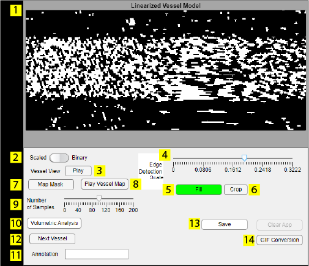

# LAVA FUNCTIONS CAN BE FOUND IN THIS FOLDER

# How to use LAVA (DRAFT IN PROGRESS)

Documentation for Spatial & Temporal Observation of Network Events (STONE) & Localized Analysis of Vascular Astrocytes (LAVA)  is licensed under <a href="https://creativecommons.org/licenses/by-nc-sa/4.0/?ref=chooser-v1" target="_blank" rel="license noopener noreferrer" style="display:inline-block;">CC BY-NC-SA 4.0</a>

Thank you for interest in LAVA!

## GUI Layout

## LAVA Layout
1. Load Data Button
2. Start Analysis
3. Experiment Trial Settings
4. App settings
5. Channel Summary Display 
6. Primary Channel Display
7. Linearized Model View
8. Model Control Panel
9. File Name Display
10. Analysis progression log and guide
11. Results plot window

## Initializing
#### 1. Drag and drop file
 
<!-- click and drag gif -->
#### 2. Open app through icon
#### 3. Launching through STONE (Coming soon)

## Loading Data Files

Click the highlighted button labeled "Load Data", then navigate the file explorer to the raw data file (.tif). Make sure the file type is enabled in the box.

### Data Import / Metadata

Metadata by default is loaded into the application's workspace by checking for known TIFF tag structures assigned by acquistion software. Currently supported acquistion software for metadata import are listed below:

ScanImage
Nikon Elements (In Progress)

For inquiries on support of additional acquistion software please contact us.

### Assigning Experimental Trial Details
Once the file is loaded, the application will prompt for stimulation trial details. If there are none, leave it blank. 

Note: Any normalized outputs will be determined by the set baseline period. The default (blank) value is the first 10 seconds of the trial. For stimulation trial experiments, maximum vascular response will be evaluated for the stimulation phase of the experiment, unless left blank.

<!-- Consider adding timeline diagram to show what analysis is performed -->

Details can be changed or added later by pressing the options button. Make sure this information is added prior to finalizing experiment data. Otherwise, you will need to process this step again (e.g. Volumetric Analysis)

## Beginning Analysis

To start image data analysis, click the "Start Analysis" button. The application will prompt to select the channel that contains the vessel image

<!--Motion detection options? -->

Once the boundaries of the vessel of interest are established, the application will prompt to set an expansion distance for the model. The distance should be sufficient to capture the entire vessel's diameter and perivascular space. The pop up slider window converts pixel values into real distance based on imported or assigned metadata. More information on metadata and sizing conversions in the Data Import section.

No Extension ❌ | Extension ✅
:--------------:|:--------------------:
 | 

### Refining the Model and Indexing Vessel

Using the model control panel, further refine the vessel of interest and perform the remaining calculations.

### Model Control Panel
1. Model View
2. View Option
3. Play Button
4. Edge Detection Slider
5. [Fill Gaps Button](#Fill)
6. [Crop Tool](#Crop)
7. Map Mask to Model
8. Play Model on Primary Channel Display Window
9. [Model Size Slider (Data reduction option)](#number-of-samples-slider)
10. [Calculate Volume / Set Model Parameters](Volumetric-Analysis)
11. Annotation Edit Field
12. Analyze Next Vessel
13. [Save Button](#Saving)
14. Asset Export Tool

### Fill
 
Pressing the Fill button with fill gaps in the vessel due to intensity variations.
### Crop

After pressing the crop button, a selection target reticle will appear. Click the left and right boundaries that contain the segment of vessel that you intend to keep for measurement. 

<!--Undo button needed -->

### Number of Samples Slider
Due to differences in imaging resolution, vessel size, and computational capacity of analysis machines, data reduction may be necessary or desired to speed up processing time, and to reduce final data structure size. Lowering the value of the slider will reduce the number of cross sections used for volume and further correlational analyses. This will reduce the effective resolution of models and the results data structure.

### Map Mask
Once the vessel has been prepared, the "Map Mask" button should already be illuminated in green. Pressing this button will process the mask into the model and prepare the final cross sections for size calculations.
### Play Vessel Map
Displays the resulting vessel captured by the model in the image stack.

### Annotations
Editing the text field will assign an annotation to the vessel in progress.

### Volumetric Analysis
Calculates Vessel volume and indexes cross section area arrays with set annotation.

Once complete the linearized vessel view will show the cross section points used for calculations.

The generated time series data is visible below the primary channel display window.

Once complete, you can move on to analyze another vessel by pressing the "Next Vessel" button.

### Saving
When the application detects results in the data structure, the save button will illuminate green. At this point, you may save your results and exit the application. However, if there are additional fluorescence channels with activity in the perivascular space, you may continue the analysis with those channels. Additional instructions are below in the [Perivascular Fluorescence](#Perivascular-Fluorescence) section.

Currently, data structures are only output into .mat files.

### Asset Export Tool

### Perivascular Fluorescence
Once vascular data has been saved, the user may optionally analyze fluorescence activity data from perivascular spaces. To begin, press the "Perivascular Fluorescence Analysis" button.

A selection window will appear to specify the vessel to move forward with. If multiple vessels have already been analyzed, the selection menu will list them in the order they were processed.

The "Edge Detection Slider" used previously for determining vessel masks will now be relabeled as "Intensity Detection". The values on the slider will now represent the normalized activity of the vascular and perivascular space in standard deviations (0 = lowest activity STD, 1 = highest activity STD)

Vessel Location | Activity Map | Exclusions
:-----------:|:-------------:|:---------:
 |  | 
The initial view displays the location of the vessel of interest. | Moving the slider will change the view to the activity map in STD. | The slider value will mask out pixels whose activity falls below the threshold set by the slider.

Masking using the slider is optional, but serves as a visual aid for the user to identify regions with activity of significance. The following step requires that the user identify a region of interest in the perivascular space. Clicking the "Draw ROI" button will activate a point drawing tool on the image. The tool operates with the same controls as the vascular tracing tool. Left click to add vertices around the region of interest. Right clicking anywhere or left clicking the first draw point will close the tool and close the polygon. Once finished, the user may opt to create additional ROIs by clicking the "Draw ROI" button again. Once the desired ROIs are drawn, finalize the analysis by clicking the "Analyze" button.

Later in the analysis, LAVA can conduct analysis without explicit ROI identification for general correlational analysis of vascular to fluorescence activity.

### Additional Controls

Rocker Control | Vessel View | Perivascular View
:---:|:---:|:----:
 |  | 

The vascular channel can be viewed by clicking the rocker switch on the left of the control panel (Vascular Channel Name -- Current Fluorescence Channel Name) Additional view settings with this rocker can be set with Additional Options. (Coming soon)

### Bridging to STONE / Advanced Correlational Analysis
 COMING SOON

l
