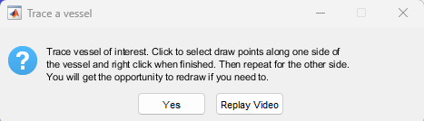
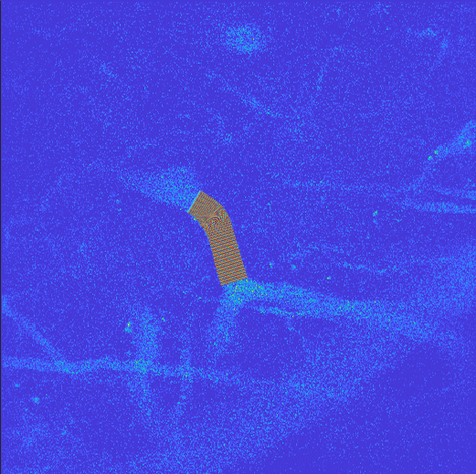

# LAVA FUNCTIONS CAN BE FOUND IN THIS FOLDER

# How to use LAVA (DRAFT IN PROGRESS)

Documentation for Spatial & Temporal Observation of Network Events (STONE) & Localized Analysis of Vascular Astrocytes (LAVA)  is licensed under <a href="https://creativecommons.org/licenses/by-nc-sa/4.0/?ref=chooser-v1" target="_blank" rel="license noopener noreferrer" style="display:inline-block;">CC BY-NC-SA 4.0</a>

## Initializing
### 1. Drag and drop file
 
<!-- click and drag gif -->
### 2. Open app through icon
### 3. Launching through STONE (Coming soon)

## Loading Data Files

Click the highlighted button labeled "Load Data", then navigate the file explorer to the raw data file (.tif). Make sure the file type is enabled in the box.

#### Assigning Experimental Trial Details
Once the file is loaded, the application will prompt for stimulation trial details. If there are none, leave it blank. 

Note: Any normalized outputs will be determined by the set baseline period. The default (blank) value is the first 10 seconds of the trial. For stimulation trial experiments, maximum vascular response will be evaluated for the stimulation phase of the experiment, unless left blank.

<!-- Consider adding timeline diagram to show what analysis is performed -->

Details can be changed or added later by pressing the options button. Make sure this information is added prior to finalizing experiment data. Otherwise, you will need to process this step again (e.g. Volumetric Analysis)

## Beginning Analysis

To start image data analysis, click the "Start Analysis" button. The application will prompt to select the channel that contains the vessel image

<!--Motion detection options? -->

No Extension ❌ | Extension ✅
:--------------:|:--------------------:
 | 

### Refining the Model and Indexing Vessel

Below are the controls used to further refine the vessel of interest and perform the remaining calculations.

Contents:
1. Model View
2. View Option
3. Play Button
4. Edge Detection Slider
5. Fill Gaps Button
6. Crop Tool
7. Map Mask to Model
8. Play Model on Primary Display
9. Model Size Slider (Data reduction option)
10. Calculate Volume / Set Model Parameters
11. Annotation Edit Field
12. Analyze Next Vessel
13. Save Button
14. Asset Export Tool

#### Fill
 
Pressing the Fill button with fill gaps in the vessel due to intensity variations.
#### Crop

After pressing the crop button, a selection target reticle will appear. Click the left and right boundaries that contain the segment of vessel that you intend to keep for measurement. 

<!--Undo button needed -->

#### Number of Samples Slider
Due to differences in imaging resolution, vessel size, and computational capacity of analysis machines, data reduction may be necessary or desired to speed up processing time, and to reduce final data structure size. Lowering the value of the slider will reduce the number of cross sections used for volume and further correlational analyses. This will reduce the effective resolution of models and the results data structure.

#### Map Mask
Once the vessel has been prepared, the "Map Mask" button should already be illuminated in green. Pressing this button will process the mask into the model and prepare the final cross sections for size calculations.
#### Play Vessel Map
Displays the resulting vessel captured by the model in the image stack.

#### Annotations
Editing the text field will assign an annotation to the vessel in progress.

#### Volumetric Analysis
Calculates Vessel volume and indexes cross section area arrays with set annotation.

#### Perivascular Fluorescence

#### Saving
Currently data is only output into .mat files

#### Asset Export Tool

#### Bridging to STONE / Advanced Correlational Analysis
 COMING SOON

l
l
l
l

